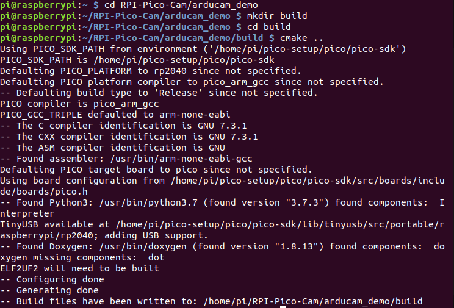
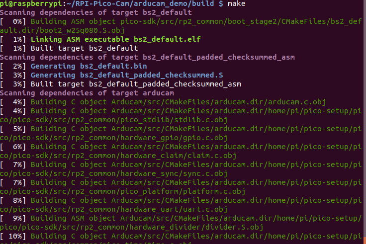
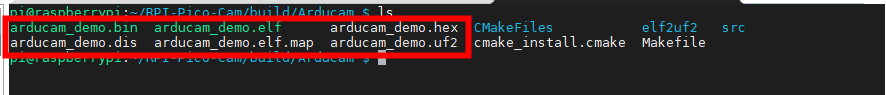
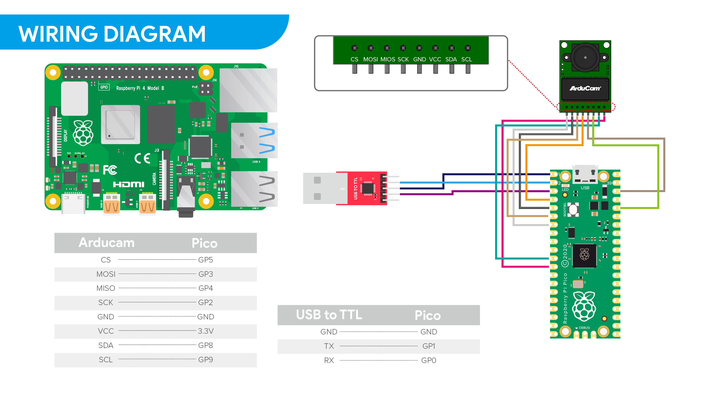
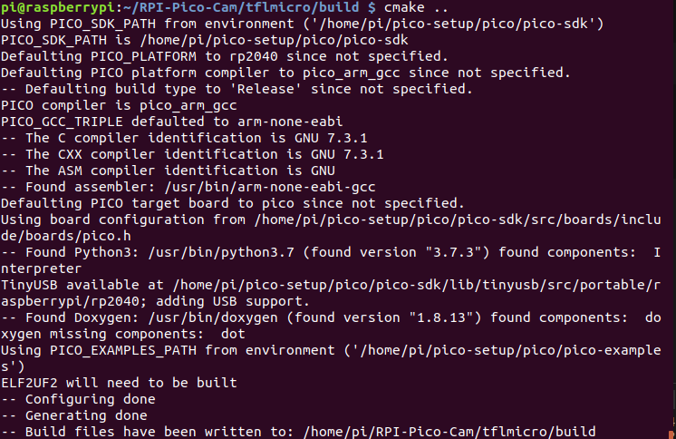
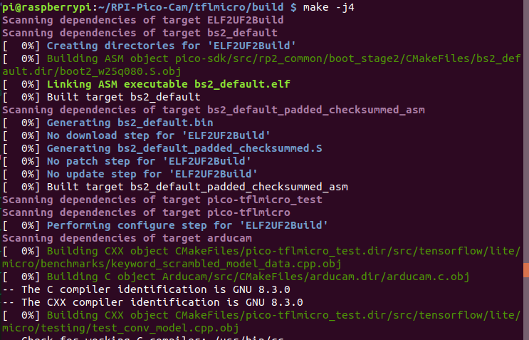
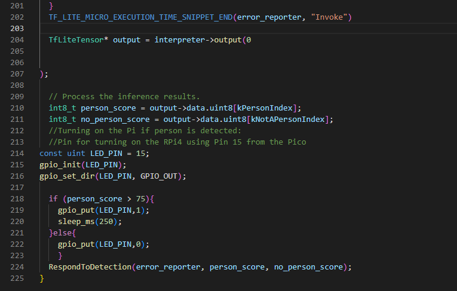
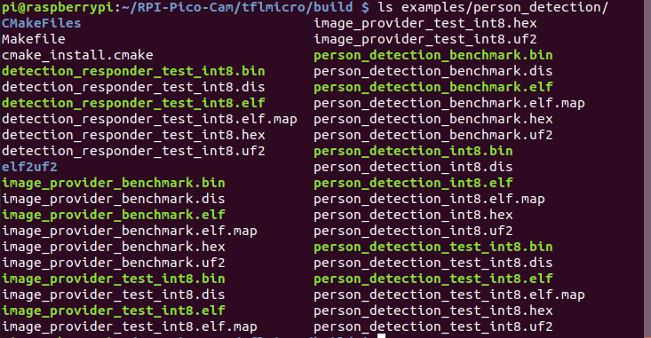
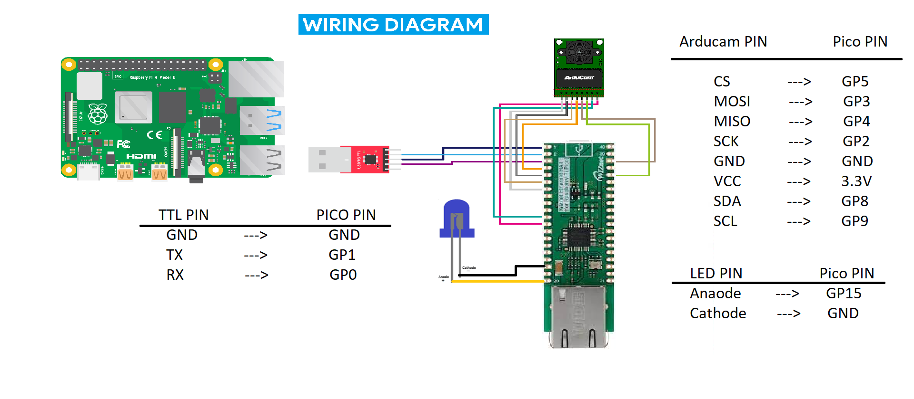

# Wiznet PICO Arducam Examples

Table of contents
=================
* [Getting Started](#Getting-Started)
* [Quick Pico Setup](#Quick-Pico-Setup)
* [Person Detection](#Person-Detection)
   * [Download and Build](#Person-Detection)
   * [Test Person Detection](#Test-Person-Detection)

# Getting started

See [Getting Started with the Raspberry Pi Pico](https://rptl.io/pico-get-started) and the README in the [pico-sdk](https://github.com/raspberrypi/pico-sdk) for information
on getting up and running.

# Quick Pico Setup
If you are developing for Raspberry Pi Pico on the Raspberry Pi 4B, or the Raspberry Pi 400, most of the installation steps
in this Getting Started guide can be skipped by running the setup script. You can get this script by doing the following:

```bash
git clone https://github.com/raspberrypi/pico-setup.git
```
Then run: 
```bash
 pico-setup/pico_setup.sh
```
The script will:

- Create a directory called pico
- Install required dependencies
- Download the pico-sdk, pico-examples, pico-extras, and pico-playground repositories
- Define PICO_SDK_PATH, PICO_EXAMPLES_PATH, PICO_EXTRAS_PATH, and PICO_PLAYGROUND_PATH in your ~/.bashrc
- Build the blink and hello_world examples in pico-examples/build/blink and pico-examples/build/hello_world
- Download and build picotool (see Appendix B). Copy it to /usr/local/bin. • Download and build picoprobe.
- Configure the Raspberry Pi UART for use with Raspberry Pi Pico

Once it has run, you will need to reboot your Raspberry Pi,
```bash
sudo reboot
```

### Get Arducam Example
- Download RPI-Pico-Cam example for video streaming
```bash 
git clone https://github.com/ArduCAM/RPI-Pico-Cam.git
```
- Compile 
```bash
cd RPI-Pico-Cam/arducam_demo
mkdir build 
cd build 
cmake ..
```

```bash
make
```
  
Then you will creat some files under RPI-Pico-Cam/arducam_demo/build/Arducam path 
Bin|Description
---|---
[arducam_demo.elf](arducam_demo) | which is used by the debugger.
[arducam_demo.uf2](arducam_demo) | which can be dragged onto the RP2040 USB Mass Storage Device.



### Test Arducam demo 

App|Description
---|---
[arducam_demo](arducam_demo) | This is a video streaming demo.

- Hardware connection 



- Load and run arducam_demo 
The simplest method to load software onto a RP2040-based board is by mounting it as a USB Mass Storage Device.
Doing this allows you to drag a file onto the board to program the flash. Go ahead and connect the Raspberry Pi Pico to
your Raspberry Pi using a micro-USB cable, making sure that you hold down the BOOTSEL button to force it into
USB Mass Storage Mode.

If you are logged in via ssh for example, you may have to mount the mass storage device manually:
```bash
$ dmesg | tail
[ 371.973555] sd 0:0:0:0: [sda] Attached SCSI removable disk
$ sudo mkdir -p /mnt/pico
$ sudo mount /dev/sda1 /mnt/pico
```
If you can see files in /mnt/pico then the USB Mass Storage Device has been mounted correctly:
```bash
$ ls /mnt/pico/
INDEX.HTM INFO_UF2.TXT
Copy your arducam_demo.uf2 onto RP2040:
sudo cp arducam_demo.uf2 /mnt/pico
sudo sync
```

## Person Detection with LED ON and OFF based on person detection score
- Download RPI-Pico-Cam
```bash 
git clone https://github.com/Innovation4x/WIZnetIoT.git
```
- Compile 
```bash
cd RPI-Pico-Cam/tflmicro
mkdir build 
cd build 
cmake ..
```

```bash
make
```
  
Then you will creat some files under RPI-Pico-Cam/tflmicro/build/examples/person_detection path 
Bin|Description
---|---
[person_detection_int8.uf2](tflmicro/bin/person_detection_int8.uf2) | This is the main program of person_detection, which can be dragged onto the RP2040 USB Mass Storage Device.
 
 The code in the [main_functions.cpp](tflmicro/examples/peron_detection/main_functions.cpp) edited by initializing PIN 15 as OUTPUT and controlling the LED ON and OFF depending on the person detection  score. snipet of the edited code is shown below. 


Again build the binary files using the cmake commands refering the previous commands. Once the file is built you should be able to see the binary file in the build directry under the name person_detection_in8.bin.



### Test Person Detection

App|Description
---|---
[person_detection_int8](tflmicro/examples/person_detection/main_functions.cpp) | This is a person detection demo.

- Hardware connection 



- Load and run person_detection 
The simplest method to load software onto a RP2040-based board is by mounting it as a USB Mass Storage Device.
Doing this allows you to drag a file onto the board to program the flash. Go ahead and connect the Raspberry Pi Pico to
your Raspberry Pi using a micro-USB cable, making sure that you hold down the BOOTSEL button to force it into
USB Mass Storage Mode.

If you are logged in via ssh for example, you may have to mount the mass storage device manually:
```bash
$ dmesg | tail
[ 371.973555] sd 0:0:0:0: [sda] Attached SCSI removable disk
$ sudo mkdir -p /mnt/pico
$ sudo mount /dev/sda1 /mnt/pico
```
If you can see files in /mnt/pico then the USB Mass Storage Device has been mounted correctly:
```bash
$ ls /mnt/pico/
INDEX.HTM INFO_UF2.TXT
```
Copy your person_detection_int8.uf2 onto RP2040:
```bash
sudo cp examples/person_detection/person_detection_int8.uf2 /mnt/pico
sudo sync
```

### View output

The person detection example outputs some information through usb, you can use minicom to view:
```bash
minicom -b 115200 -o -D /dev/ttyACM0
```

The person detection example also outputs the image data and person detection results to the UART, and we provide [a processing program](tflmicro/person_detection_display/person_detection_display.pde) to display them:

Changes are made in the peroson detection code to turn ON and OFF the LED. The LED pin in connected to 15th GPIO pin on the wiznet pico board. When the score of the preson detection is above 75% the LED will turn On or it will be OFF.
